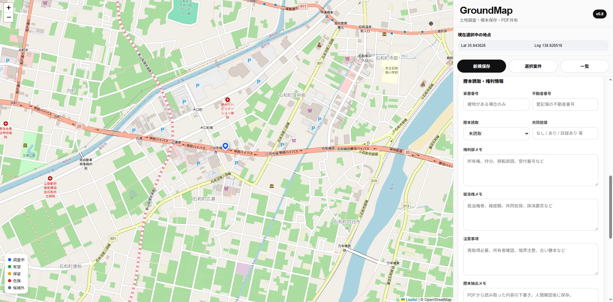
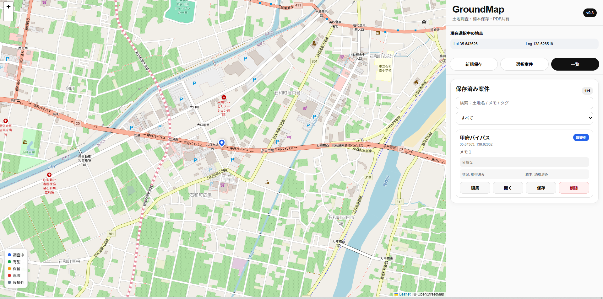
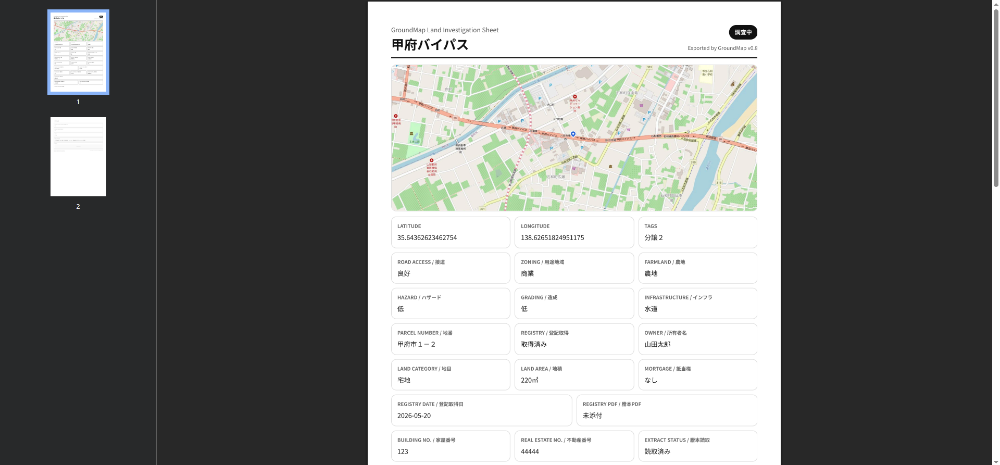

# GroundMap

土地調査・案件管理向けWebアプリケーションです。

## Features

- 地図上で候補地を管理
- 土地情報の保存
- 調査ステータス管理
- 写真管理
- PDF調査シート生成
- 登記情報管理
- 調査メモ管理

## Tech Stack

- Node.js
- Express
- JavaScript
- React
- Leaflet
- PDF Generation
- Linux VPS
- PM2

## Purpose

不動産調査業務の効率化を目的として開発した個人プロジェクトです。

地図上で候補地を管理し、現地調査メモや写真、土地情報をまとめて保存し、PDF調査シートとして出力できることを目指しています。

# Screenshots

## Main Screen

土地調査地点を地図上で管理し、登記情報や現地調査内容を記録できます。

---

## Case Management

保存済み案件の検索・編集・管理が可能です。

---

## PDF Export

登録した案件情報を調査シートとしてPDF出力できます。

# Screenshots

## Main Screen

土地調査地点を地図上で管理し、登記情報や現地調査内容を記録できます。

---

## Case Management

保存済み案件の検索・編集・管理が可能です。

---

## PDF Export

登録した案件情報を調査シートとしてPDF出力できます。

